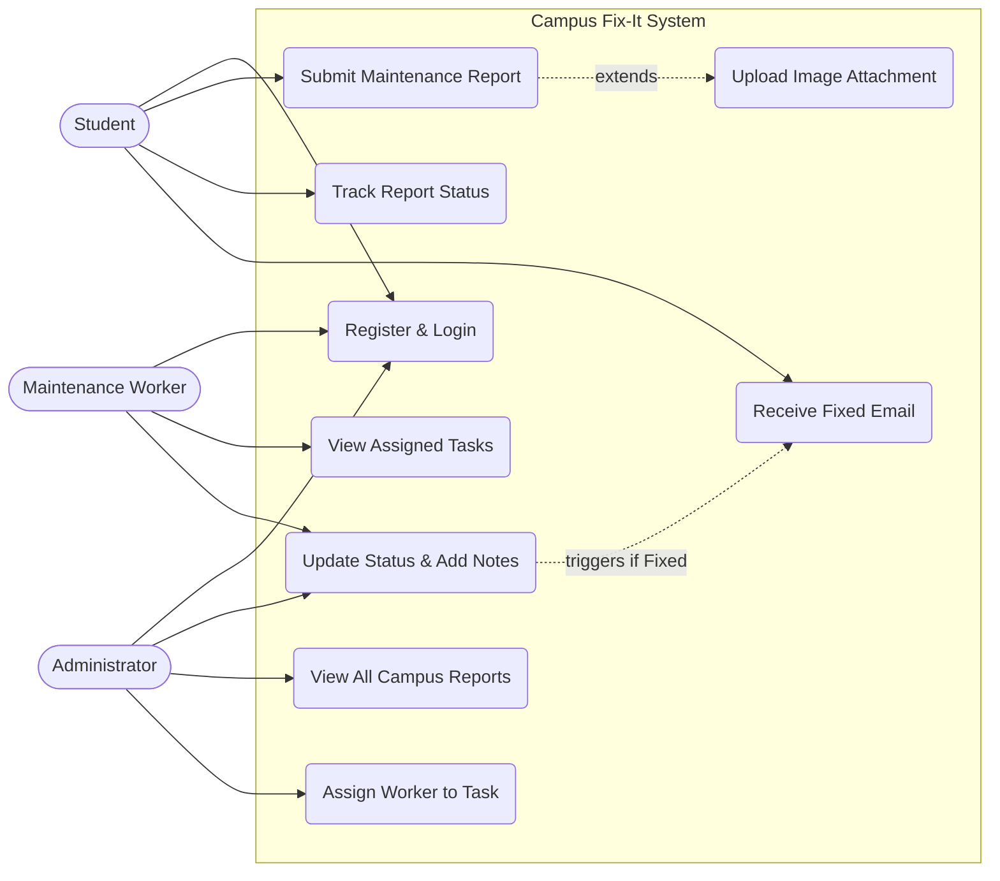
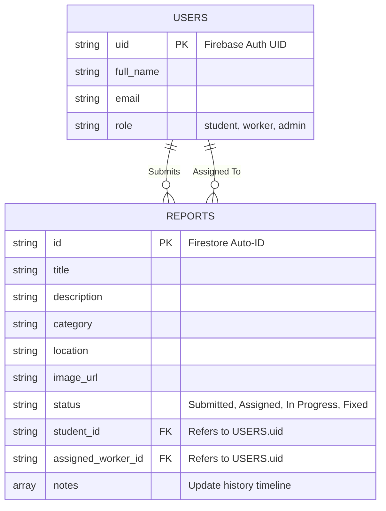

# COM 2301 PROJECT PART B: FINAL REPORT
**Project Name:** Campus Fix-It Web Application

---

## 1. Problem Identification

*   **The Problem:** Campus facilities like broken chairs, leaking pipes, or bad Wi-Fi often stay broken for a very long time because the reporting system is slow and based on paper.
*   **Where the problem occurs:** It happens everywhere on campus—in lecture halls, libraries, cafeterias, and student residences.
*   **Who is affected:** Students cannot study properly, lecturers are delayed, and maintenance staff struggle to know which jobs are most important.
*   **How the current process works:** Right now, students have to walk to a physical office to fill out a form or send an email. Papers get lost, emails are ignored, and the student never gets an update on whether anyone is coming to fix it.
*   **Why the problem needs a solution:** Broken infrastructure causes safety risks and frustration. The university needs a fast, digital system so that problems are reported instantly, tracked easily, and fixed quickly without any confusion.

---

## 2. Proposed Solution

The proposed solution is **Campus Fix-It**, a centralized web and mobile application designed to replace the slow, manual reporting system and the disorganized WhatsApp groups currently used on campus.

*   **What the system will do:** It allows students and staff to instantly report broken facilities (lights, taps, toilets, WiFi) by simply taking a photo, adding the specific location (e.g., "Residence A, Room 12" or "Lab 3"), and submitting it. The app automatically creates a trackable ticket and follows the issue from submission to resolution, eliminating the need to walk to the Estate office.

*   **Who will use it:**
    *   **Students & Staff:** To report issues instantly from their phones and check the real-time status of their reports without needing to ask in WhatsApp groups.
    *   **Maintenance Workers:** To receive assigned tickets directly on their devices, view the photo and location, and update the status (e.g., "In Progress" or "Fixed").
    *   **Administrators (Estate Office):** To view a live dashboard of all reported issues, assign the correct worker to each job, and monitor response times.

*   **The Main Features:**
    *   **Photo & Location Reporting:** A simple form where users upload a picture of the broken item and select the exact building/room.
    *   **Live, Auto-Updating Dashboards:** The dashboards are connected to a real-time database, meaning the statistics and numbers update automatically right before your eyes without anyone needing to refresh the page.
    *   **Real-Time Status Tracking:** A dashboard for students showing if their report is Submitted, Assigned, In Progress, or Fixed.
    *   **Admin Assignment Dashboard:** A central hub for the Estate office to view all pending jobs and assign them to specific maintenance workers.
    *   **Automated Notifications:** Emails or app alerts sent to the student when their issue is resolved, eliminating the "no feedback" problem.
    *   **Secure Login:** Ensures only verified campus members can submit reports.

*   **How it addresses the identified problem:**
    *   **Eliminates Physical Reporting:** Students no longer need to walk to the Estate office or write in a book; they can report a broken toilet or tap instantly from their residence.
    *   **Replaces WhatsApp Groups:** It removes the chaos of WhatsApp groups where messages get lost. Every report becomes a trackable ticket.
    *   **Saves Time & Provides Feedback:** It eliminates the weeks of waiting and lack of feedback by providing a transparent, trackable timeline for every issue.
    *   **Fixes WiFi & Infrastructure Faster:** By prioritizing jobs on a dashboard, administrators can ensure critical issues like no WiFi in lecture halls or broken lights are assigned and fixed quickly.

---

## 3. Feasibility Study

We checked if this project could actually be built and used in the real world:

*   **Technical Feasibility:** The system uses standard web tools (HTML, CSS, Vanilla JavaScript) paired with a real-time database (Firebase Firestore) and serverless functions (Vercel). Because these tools are modern and easy to connect, the project is highly technically feasible.
*   **Economic Feasibility:** The cost is basically zero for a prototype. Firebase, Vercel, and ImgBB all offer free tiers. The university already provides Wi-Fi, and students already own smartphones. Therefore, it is perfectly economically feasible.
*   **Operational Feasibility:** Taking a picture of a broken chair and clicking "Submit" is very easy for any student. It fits perfectly into daily campus life. Workers will also find it easier than carrying paper clipboards. It is operationally feasible.
*   **Schedule Feasibility:** Because we used lightweight code instead of building a heavy backend from scratch, the system was built and tested within the assignment timeframe. It is schedule feasible.

**Conclusion:** The solution is **Feasible**.

---

## 4. System Design

### 4.1 Functional Requirements
*   Users must be able to securely register, log in, and reset their passwords.
*   Students must be able to submit reports with an image attached.
*   Workers must be able to view their specific tasks and update the status to "In Progress" or "Fixed".
*   Administrators must be able to view all reports and assign specific workers to them.
*   The system must add a timestamped note to the history whenever a status is updated.
*   The system must send an automated email to the student when their issue is marked as "Fixed".

### 4.2 Non-Functional Requirements
*   **Performance:** The app must be fast and load quickly.
*   **Scalability:** The Firebase database must handle many students reporting issues at the same time.
*   **Usability:** The design must look modern and work perfectly on mobile phones.
*   **Security:** Users must only be allowed to access their own role's dashboard.

### 4.3 Use Case Diagram
*(This is the Mermaid Use Case Diagram showing how everyone interacts with the system).*

### 4.4 Database Design (ERD)
*(This is the Entity-Relationship Diagram for our NoSQL Firebase Firestore database).*

### 4.5 User-Interface Designs

*Note: You need to replace the placeholders below with the actual screenshots of your running app. To take screenshots, use the Snipping Tool (Windows) or Cmd+Shift+4 (Mac) and save them in your project folder.*

**1. Registration & Login Screen**

*Description: This screen allows new users (students, workers) to securely register for an account using their university email or log into an existing account.*

**2. Student Dashboard**

*Description: The main landing page for students where they can see their previous reports and check their current status.*

**3. Submit Report Form**

*Description: The form where students enter details of the maintenance issue (category, location, description) and upload a photo.*

**4. Admin Dashboard**

*Description: The global view for administrators showing all campus issues, statistics, and the interface to assign tasks to maintenance workers.*

---

## 5. Prototype

For this project, we didn't just want to draw pictures or make a click-through design. We actually built a real, working web application to show exactly how Campus Fix-It would operate in real life. The assignment brief clearly stated that "static screenshots alone are not sufficient," so we made sure our prototype is 100% interactive. You can actually click buttons, fill in forms, and see data change in real time.

We decided to host the app online so that anyone can test it out on their phone or laptop without needing to install anything. The app is connected to a live Firebase database, which means when a student submits a problem, the admin sees it pop up immediately on their screen.

*   **Live Prototype Link:** [Insert your live link here, e.g., https://campus-fix-it.vercel.app]
*   **GitHub Source Code:** [Insert your GitHub Repository Link Here]

### 5.1 Fictional Data Used for the Demo
Since this is a prototype, we couldn't use real students' details or real university maintenance records. Instead, we created some sample data to make the system look and act like it's being used on a busy day at campus. We did this so that during our presentation, we can show exactly how the system handles different types of problems.

**Our Fake Users:**
We created three types of accounts to show how the different dashboards work:
*   **The Student (John Doe - student@mvula.univen.ac.za):** We use this account to show how easy it is to report a problem.
*   **The Maintenance Worker (Mike - mike@worker.univen.ac.za):** We log into this account to show what the workers see on their phones when they get assigned a job.
*   **The Admin (Alice - admin@univen.ac.za):** We use this account to demonstrate how the university management can see everything happening on campus.

**Sample Maintenance Reports:**
To make the demo realistic, we added three common campus problems into the database. We put each one in a different "stage" of the process so you can see how the system tracks them:

1.  **The Broken Projector (Status: Fixed)** 
    *   *What happened:* We pretended a projector was broken in Lecture Hall A. 
    *   *Why we added it:* We pushed this report all the way through the system to "Fixed" to show the complete history timeline. We wanted to prove that the system can successfully close a ticket.
    
2.  **The Burst Water Pipe (Status: In Progress)**
    *   *What happened:* A pipe burst in Student Residence Block B and is flooding the floor.
    *   *Why we added it:* We set this one to "In Progress" to show what a worker's screen looks like while they are busy with an urgent job.

3.  **The Bad Wi-Fi (Status: Submitted)**
    *   *What happened:* The internet is dropping on the 2nd floor of the Main Library.
    *   *Why we added it:* This is a brand new ticket. It shows how a new report lands on the Admin's desk, waiting for them to assign it to an IT worker.

By putting all this fictional data into the app, it makes it much easier to test the prototype and proves that all our features actually work properly!

---

## 6. Testing

We tested the entire application to ensure every single feature works perfectly.

| Test ID | Test Description (Function) | Expected Result | Actual Result | Status |
| :--- | :--- | :--- | :--- | :--- |
| **TC01** | **User Registration:** Sign up using a valid `@mvula.univen.ac.za` email address. | Account is successfully created in Firebase. User goes to Student Dashboard. | Account created perfectly. Redirected to dashboard. | ✅ Pass |
| **TC02** | **Invalid Registration:** Try to register with a normal `@gmail.com` address. | System rejects the registration and shows an error. | Blocked by browser validation; error message shown. | ✅ Pass |
| **TC03** | **User Login Roles:** Log in as a Student, a Worker, and an Admin. | System securely checks their role and sends them to their correct dashboard. | Role access control worked perfectly; no cross-access allowed. | ✅ Pass |
| **TC04** | **Submit Report & Image:** Submit a report and attach a picture. | Image uploads to ImgBB API. URL and report data save to the database. | Image uploaded successfully; Report shows up on the student's screen. | ✅ Pass |
| **TC05** | **Admin Dashboard:** Log in as Admin to see the global view. | Dashboard pulls all campus reports and calculates total statistics. | Dashboard loaded dynamically; stats calculated correctly. | ✅ Pass |
| **TC06** | **Assign Worker:** Admin assigns a specific worker to a pending task. | Database updates, and status changes to "Assigned". | Database updated; task now appears on the worker's personal portal. | ✅ Pass |
| **TC07** | **Update Status & Notes:** Worker changes status to "In Progress" and leaves a comment. | Status updates. Comment is saved to the history timeline. | Status changed; comment appeared in history timeline with worker's name. | ✅ Pass |
| **TC08** | **Send Fixed Email:** Worker changes a report's status to "Fixed". | Vercel backend securely triggers EmailJS to send a custom email. | Status changed to Fixed; Student received the email notification. | ✅ Pass |
| **TC09** | **OTP Request:** Click "Forgot Password" and request a reset. | Backend creates a 6-digit OTP, saves it securely, and emails it. | OTP generated, stored, and emailed successfully. | ✅ Pass |
| **TC10** | **OTP Verification:** Enter the 6-digit OTP received in the email. | System checks OTP. If correct, password is automatically updated. | OTP verified; password updated; user logged in successfully. | ✅ Pass |

---

## 7. Presentation Outline

*(Student Note: Use this script for your PowerPoint slides during the demo)*

1.  **Slide 1: Title Screen** - "Campus Fix-It: Solving campus maintenance."
2.  **Slide 2: The Problem** - Explain how paper reports get lost, things stay broken for months, and students have no idea if anyone is coming to fix it.
3.  **Slide 3: Proposed Solution** - Introduce the digital web app where students report issues via phone, and admins track them.
4.  **Slide 4: Feasibility** - Explain that it is highly feasible and costs $0 because we used free tools like Firebase and Vercel.
5.  **Slide 5: System Design** - Show your Use Case Diagram so they understand how Students, Workers, and Admins interact with the system.
6.  **Slide 6: Live Demonstration!** 
    *   Show logging in as a student and submitting a report with a picture.
    *   Show logging in as an admin and assigning a worker.
    *   Show logging in as the worker and marking it "Fixed".
    *   Show the automated email arriving in your inbox!
