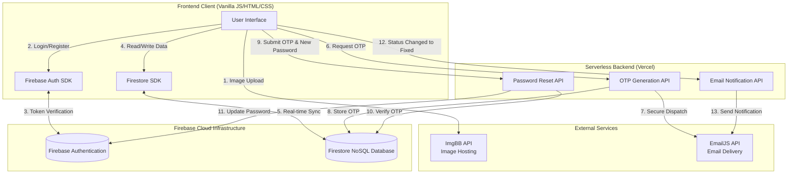
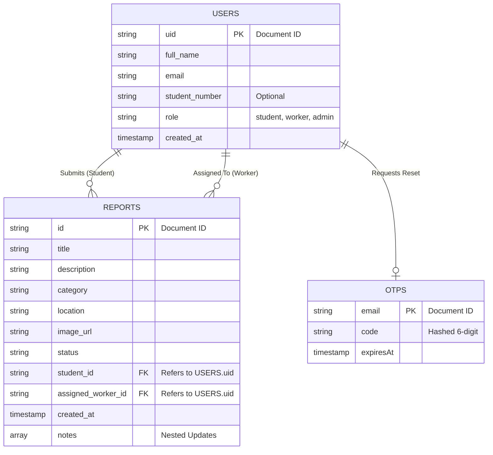

# 4. System Design

## 4.1 Functional Requirements
Functional requirements define the specific behaviors and functions the system must support.

*   **User Authentication & Authorization:**
    *   The system must allow users to register and log in securely.
    *   The system must support role-based access control (Student, Maintenance Worker, Admin).
    *   The system must provide a secure password reset mechanism using a 6-digit OTP sent via email.
*   **Issue Reporting (Students):**
    *   Students must be able to submit a new maintenance report specifying a title, description, category, and physical location.
    *   The system must allow students to attach an image to their report (hosted via ImgBB).
    *   Students must be able to view a history of their submitted reports and track their current status (e.g., Submitted, Under Review, Assigned, In Progress, Fixed).
*   **Issue Management (Workers):**
    *   Maintenance workers must be able to view a dashboard of tasks assigned specifically to them.
    *   Workers must be able to update the status of a report and add comments/notes as progress is made.
*   **System Administration (Admins):**
    *   Admins must have access to a global dashboard to view all reports submitted across the campus.
    *   Admins must be able to assign submitted reports to specific maintenance workers.
    *   Admins must be able to update report statuses and communicate updates to students.
*   **Notifications:**
    *   The system must automatically trigger an email notification to the student when their reported issue is marked as "Fixed".

## 4.2 Non-Functional Requirements
Non-functional requirements specify the quality attributes, performance, and security constraints of the system.

*   **Performance:** The web application must be lightweight and load quickly (under 2-3 seconds) on standard campus Wi-Fi. This is achieved by utilizing Vanilla HTML/CSS/JS without heavy frontend frameworks.
*   **Scalability:** The backend must handle high concurrency during peak usage times. Utilizing Vercel Serverless Functions and Firebase Firestore ensures the infrastructure scales automatically based on demand.
*   **Security:**
    *   Firestore Security Rules must restrict data access so users can only view their own personal information and reports, while Admins/Workers have broader access.
    *   OTP verification for password resets must be executed strictly on the backend to prevent client-side manipulation.
*   **Usability:** The user interface must be fully responsive, ensuring seamless operation on mobile devices (smartphones/tablets) since students are likely to report issues while walking around campus.
*   **Reliability & Availability:** The system must aim for 99.9% uptime, leveraging robust cloud hosting providers (Vercel and Firebase).

## 4.3 Use Case Diagram
The following use case diagram illustrates the interactions between the different actors (Student, Worker, Admin) and the Campus Fix-It system.

```mermaid
usecaseDiagram
    actor Student
    actor Worker
    actor Admin

    package "Campus Fix-It System" {
        %% General Authentication
        usecase "Register Account" as UC1
        usecase "Login" as UC2
        usecase "Reset Password (OTP)" as UC3
        
        %% Student specific
        usecase "Submit Maintenance Report" as UC4
        usecase "Upload Image Attachment" as UC5
        usecase "View Personal Report History" as UC6
        usecase "Track Report Status" as UC7
        
        %% Worker specific
        usecase "View Assigned Reports" as UC8
        usecase "Update Report Status" as UC9
        usecase "Add Progress Notes / Comments" as UC10
        usecase "View Dashboard Stats" as UC11
        
        %% Admin specific
        usecase "View All Campus Reports" as UC12
        usecase "Filter & Search Reports" as UC13
        usecase "Assign Worker to Report" as UC14
        usecase "Delete Reports (Single/Bulk)" as UC15
        usecase "Manage Staff (Add/Remove Workers)" as UC16
        usecase "View Global Analytics" as UC17
        
        %% System Automated
        usecase "Send 'Fixed' Email Notification" as UC18
    }

    Student --> UC1
    Student --> UC2
    Student --> UC3
    Student --> UC4
    Student --> UC6
    Student --> UC7

    Worker --> UC2
    Worker --> UC3
    Worker --> UC8
    Worker --> UC9
    Worker --> UC10
    Worker --> UC11

    Admin --> UC2
    Admin --> UC3
    Admin --> UC9
    Admin --> UC10
    Admin --> UC12
    Admin --> UC13
    Admin --> UC14
    Admin --> UC15
    Admin --> UC16
    Admin --> UC17
    
    UC4 ..> UC5 : <<extends>>
    UC9 ..> UC18 : <<includes>> (If status = Fixed)
```

## 4.4 Database and System Design

### System Architecture

The application uses a modern Serverless Cloud Architecture mapped out in the flowchart below:



*   **Frontend Client:** Browser running Vanilla JS, HTML, and CSS.
*   **Authentication:** Firebase Auth handles session management.
*   **Serverless Backend:** Vercel Node.js functions handle sensitive logic (email dispatching via EmailJS, OTP generation, Secure Password Reset).
*   **Database:** Firebase Firestore (NoSQL Document Database) handles real-time data storage and synchronization.

### Database Schema (Firestore NoSQL)

Below is the Entity-Relationship Diagram (ERD) representing the database collections and their relationships:



The database consists of structured Document Collections:

**1. `users` Collection**
Stores user profiles and role assignments.
*   `uid` (Document ID): string
*   `full_name`: string
*   `email`: string
*   `student_number`: string (Optional)
*   `role`: string ("student", "worker", "admin")
*   `created_at`: timestamp

**2. `reports` Collection**
Stores maintenance issues reported by students.
*   `id` (Document ID): string
*   `title`: string
*   `description`: string
*   `category`: string (e.g., Plumbing, Electrical, IT)
*   `location`: string
*   `image_url`: string (URL from ImgBB)
*   `status`: string ("Submitted", "Assigned", "In Progress", "Fixed")
*   `student_id`: string (Reference to User UID)
*   `assigned_worker_id`: string (Reference to User UID)
*   `created_at`: timestamp
*   `notes`: Array of Objects
    *   `text`: string
    *   `new_status`: string
    *   `author_name`: string
    *   `timestamp`: timestamp

**3. `otps` Collection**
Stores temporary One-Time Passwords for the secure password reset flow.
*   `email` (Document ID): string
*   `code`: string (Hashed 6-digit code)
*   `expiresAt`: timestamp

## 4.5 User-Interface Designs

> [!TIP]
> **Action Required:** For your final PDF submission, you should take actual screenshots of your running web app to replace these descriptions, as your frontend is already built!

Below are the descriptions of the key user interfaces designed for the system:

1.  **Authentication Screens (Login/Register):**
    *   A clean, centered card interface prompting for Email and Password.
    *   Includes a "Forgot Password" link that triggers the OTP modal.
    *   Modern UI with a clear primary call-to-action button.

2.  **Student Dashboard:**
    *   A responsive grid layout.
    *   A prominent "Report New Issue" button.
    *   A list/card view of their past reports showing the Title, Date, and a color-coded Status Badge (e.g., Red for Submitted, Yellow for In Progress, Green for Fixed).

3.  **Report Issue Form:**
    *   A multi-field form requesting Title, Category (Dropdown), Location, and detailed Description.
    *   An Image Upload section allowing users to select a file from their device.
    *   A submit button that provides visual feedback (loading state) while the image uploads and database syncs.

4.  **Admin / Worker Dashboard:**
    *   A data table or advanced grid listing all reports.
    *   Clicking a report opens a detailed view (Manage Report).

5.  **Manage Report View (Admin/Worker):**
    *   Displays all report details and the attached image in a split-screen responsive layout.
    *   Provides dropdowns to assign a worker and update the status.
    *   Includes an "Update History" timeline showing exactly when statuses changed and who made the change.
